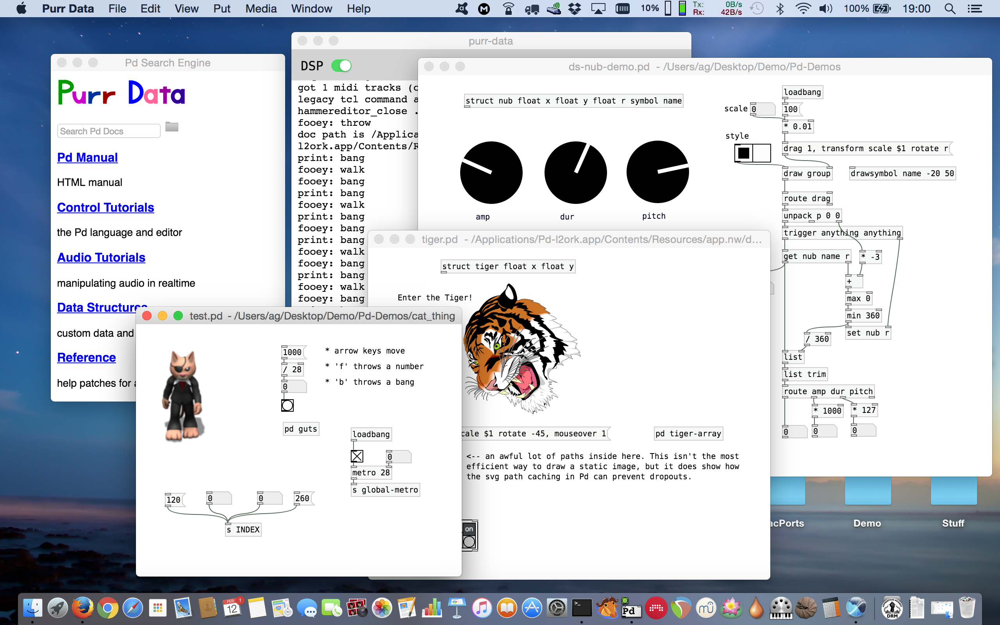

Jonathan Wilkes' **Purr Data** a.k.a. **Pd-l2ork** 2.0 is an improved version of Miller Puckette's **[Pd](http://puredata.info/)**. It is based on Ico Bukvic's **[Pd-l2ork](http://l2ork.music.vt.edu/main/make-your-own-l2ork/software/)**, which in turn is a fork of Hans-Christoph Steiner's **[Pd-extended](http://puredata.info/downloads/pd-extended)**.

This repository is a mirror of Wilkes' original Gitlab repository available at <https://git.purrdata.net/jwilkes/purr-data>. We mainly use this as a one-stop shop to make it easy for you to get your hands on the latest [source](https://github.com/agraef/purr-data) and the available [releases](https://github.com/agraef/purr-data/releases), including pre-built packages for Linux, macOS and Windows.

Here's a quick shopping list:

- [**Downloads**](https://github.com/agraef/purr-data/releases): This is where you get ready-made packages for Linux, Mac and Windows. Please also make sure to check our [installation instructions](#installation) below.
- [**JGU packages**](#jgu-packages): You can also use these if you're on [Arch](https://l2orkaur.bitbucket.io/) or a recent [Ubuntu](https://l2orkubuntu.bitbucket.io/) version.
- [**Sources**](https://github.com/agraef/purr-data): Github mirror of the sources, updated regularly.
- [**Development**](https://git.purrdata.net/jwilkes/purr-data): Wilkes' Gitlab repository. **This is where you should go for submitting bug reports and pull requests.**
- [**Mailing list**](http://disis.music.vt.edu/listinfo/l2ork-dev): The DISIS Pd-l2ork mailing list is the right place for getting help and discuss Purr Data, so please subscribe!
- [**Intro**](https://agraef.github.io/purr-data-intro): Read this to learn more about Purr Data.

There's also a [video](https://www.youtube.com/watch?v=T1wo496Zx0s) up on YouTube of the presentation *Meet the Cat: Pd-L2Ork and its New Cross-Platform Version "Purr Data"* at the Linux Audio Conference 2017 (Jean MONNET University, Saint-Etienne).

Enjoy your stay!

## About Purr Data

Pd (Pure Data) is a graphical data-flow programming environment which is geared towards real-time interactive computer music and multimedia applications. It is a full-featured open-source alternative to its commercial sibling, Cycling74's [Max](https://cycling74.com/).

Purr Data serves the same purpose, but offers a new and much improved graphical user interface and includes many 3rd party plug-ins. Like Pd, it runs on Linux, macOS and Windows, and is open-source throughout.

Purr Data also offers some notable advancements over "classic" Pd-l2ork:

- cross platform compatibility
- modern GUI written in JavaScript (using [nw.js](https://nwjs.io/))
- improved SVG graphics

Purr Data continues to offer all of Pd-l2ork's GUI and usability improvements, a help browser giving access to help patches in PDDP (Pd Documentation Project) format, and a large collection of bundled 3rd party externals, while using the latest and greatest version of Pd's tried and proven real-time engine under the hood.

## The Name?

Purr Data is the official nickname of the Pd-l2ork 2.x branch. Quite obviously the name is a play on "Pure Data" on which "Purr Data" is ultimately based. It also raises positive connotations of soothing purring sounds, and makes for a nice logo. 😺

## Installation

The easiest way to get up and running is to use one of the available binary packages and/or installers for Linux (Debian/Ubuntu), Mac and Windows available from the Github [releases](https://github.com/agraef/purr-data/releases page) to get the latest binary packages. Generally you can just double-click these packages and follow through the platform-dependent installation process.

In the case of the Debian/Ubuntu packages, this may require you to install a bunch of dependencies first, as described in the [README](https://github.com/agraef/purr-data/blob/master/README.md#linux) file. The Mac and Windows packages should be self-contained.

### JGU Packages

This is an alternative collection of ready-made Linux packages for Arch Linux and recent Ubuntu releases, maintained by the Johannes Gutenberg University (JGU). They offer the following advantages:

- "Classic" Pd-l2ork and Purr Data can be installed alongside each other (at least on older Ubuntu systems on which Pd-l2ork 1 still runs).

- The packages are available through proper package repositories ([AUR](https://aur.archlinux.org)/pacman for Arch, [Launchpad PPAs](https://launchpad.net/%7Edr-graef) for Ubuntu) and thus can be installed and updated automatically through your distribution's standard package manager. Required dependencies will also be installed automatically.

- The packages are updated more frequently (also between releases) from the current git sources whenever there are important new features or bugfixes.

- Additional programming extensions for the [Faust](http://faust.grame.fr/) and [Pure](https://agraef.github.io/pure-lang/) programming languages are available.

Please refer to the following links for more information and detailed installation instructions: [Arch](https://l2orkaur.bitbucket.io/), [Ubuntu](https://l2orkubuntu.bitbucket.io/).

### Building from Source

**CAVEAT:** Purr Data is a big package with many parts and many dependencies, so building it from source can take a *long* time, even on modern hardware. So please be patient! :)

To build Purr Data from source, you'll have to clone the [git repository](https://github.com/agraef/purr-data) as follows:

    git clone https://github.com/agraef/purr-data

Make sure that you have all the requisite dependencies installed ([Linux](https://github.com/agraef/purr-data/blob/master/README.md#linux), [Mac](https://github.com/agraef/purr-data/blob/master/README.md#osx-64-bit-using-homebrew), [Windows](https://github.com/agraef/purr-data/blob/master/README.md#windows-32-bit-using-msys2)), then run `make` in the toplevel source directory:

    make

On Debian/Ubuntu, Mac and Windows this should leave the ready-made package in the toplevel source directory. Install this as usual. On other Linux systems you can run the following command instead (this also works on Debian/Ubuntu, if you prefer this method or if you don't have the Debian packaging tools installed):

    make install

You can uninstall the software again as follows:

    make uninstall

Afterwards, to clean the source directory:

    make realclean

Note that this puts the source into pristine state again, like after a fresh checkout, so that you can run `make` from a clean slate again. Also, all build artifacts will be gone, and hence you won't be able to run `make install` or `make uninstall` any more. So you want to do this only *after* you've finished the installation process.

### Purr Data "Light"

There are some ways to speed up the build, please check the Makefile for details. In particular, try running:

    make light

This will build a minimal, no-frills, vanilla-like Purr Data system with just the essential externals included. This build finishes much faster. It will also lack the everything-and-the-kitchen-sink collection of externals which a Purr Data installation normally includes. But vanilla Pd users might actually prefer it that way.
